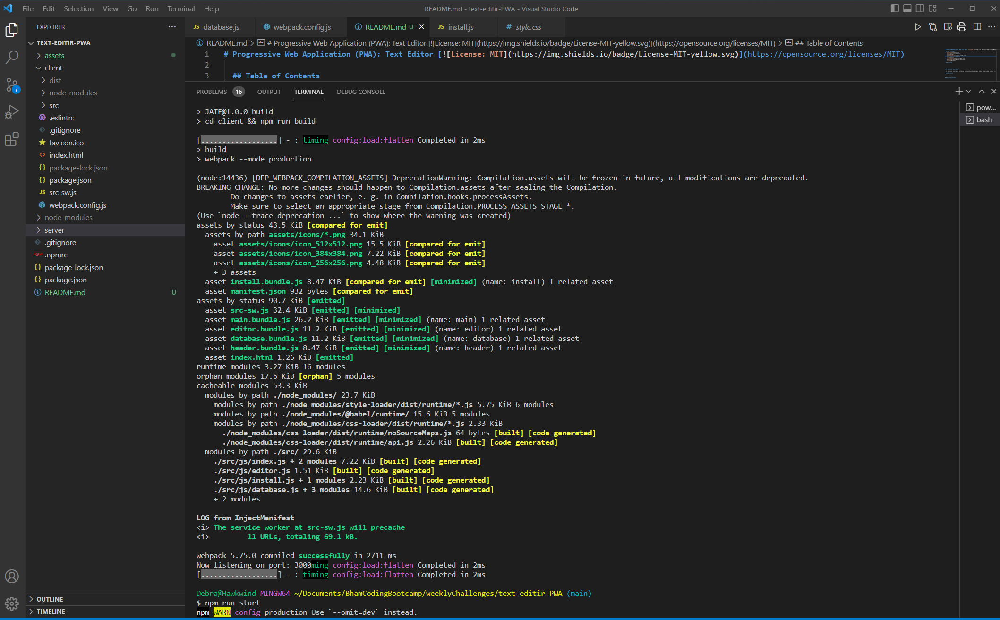
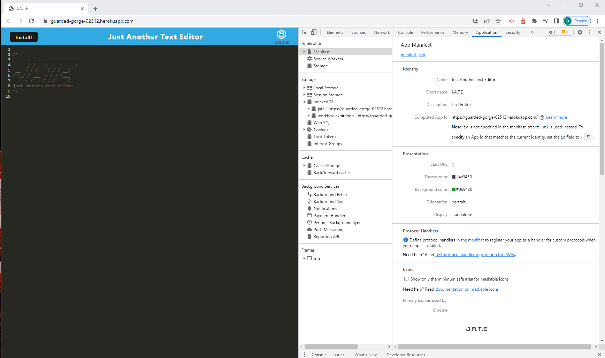

# Progressive Web Application (PWA): Text Editor [](https://opensource.org/licenses/MIT)  
  
  ## Table of Contents  
  * [Description](#description)
  * [Installation](#installation)
  * [Usage](#usage)
  * [Deployed Applicatio](#walk-through-video)
  * [Screen Shots](#screen-shots)
  * [Tests](#tests)
  * [Technologies Used](#technologies-used)  
  * [Questions](#questions) 
  * [How to Contribute](#how-to-contribute)   
  * [License](#license)
  
  ## Description

 The text editor application, JUTE (Just Another Text Editor), developed in this project is a single-page application that meets PWA criteria.  The text editor application will run in your browser and is downloadable as a web application to your desktop/device. A number of data persistance techniques have been utilized ensuring user entered data is persistent and retrievable when a application is closed and opened respectively.  The application also functions off-line maintaining data retrieval and persistance.

         
  ### Functional Requirements

  The functional requirements that Text Editor has been designed to meet are defined by the user story and acceptance criteria listed below.  

  #### User Story

  ```md
AS A developer
I WANT to create notes or code snippets with or without an internet connection
SO THAT I can reliably retrieve them for later use
```
 

#### Acceptance Criteria

```md
GIVEN a text editor web application
WHEN I open my application in my editor
THEN I should see a client server folder structure
WHEN I run `npm run start` from the root directory
THEN I find that my application should start up the backend and serve the client
WHEN I run the text editor application from my terminal
THEN I find that my JavaScript files have been bundled using webpack
WHEN I run my webpack plugins
THEN I find that I have a generated HTML file, service worker, and a manifest file
WHEN I use next-gen JavaScript in my application
THEN I find that the text editor still functions in the browser without errors
WHEN I open the text editor
THEN I find that IndexedDB has immediately created a database storage
WHEN I enter content and subsequently click off of the DOM window
THEN I find that the content in the text editor has been saved with IndexedDB
WHEN I reopen the text editor after closing it
THEN I find that the content in the text editor has been retrieved from our IndexedDB
WHEN I click on the Install button
THEN I download my web application as an icon on my desktop
WHEN I load my web application
THEN I should have a registered service worker using workbox
WHEN I register a service worker
THEN I should have my static assets pre cached upon loading along with subsequent pages and static assets
WHEN I deploy to Heroku
THEN I should have proper build scripts for a webpack application
```


  ## Installation
  
  After cloning the application follow the instructions below to install the application:

    
  Install dependencies:

       npm i

  To run the application:

    npm run start
  
  The application will run locally on your browser at localhost:3000

 ## Usage

Access the [deployed application](https://guarded-gorge-02512.herokuapp.com/) where you will be presented with the JUTE text editor.  The text editor will allow you to write notes, enter code snippets etc., that will be saved automatically.  You can also download the application to your desktop/device to use as a standalone web browser application. 
  
  
  
 ## Deployed Application

   Click on the link below to view the walk through video which demonstrates the functionality of the social networking API.

   - [Heroku Link to the JUTE text editor](https://guarded-gorge-02512.herokuapp.com/)

   

  ## Screen Shots

The following image shows the build process activated on running ```npm run start```. The build process bundles the front-end files and creates a 'dist' folder inside the client directory. 

 

 The image below shows the JATE text editor deployed to Heroku.

 

The screen shot below shows the Devtools being used to view the manifest file.

 

The screen shot below shows the Devtools being used to view the registered service worker.
 

 The screen shot below shows content has been retrieved from storage and displayed in the text editor.

 

The image below shows the pop-up window displayed when clicking on the download icon in the web browser address bar. 

 

 The image below shows the application down loaded as a  desktop icon. 

 

 The screen shot below shows the application operating as a standalone PWA. The header colour of the text editor  application changes to purple to distinguish as a standalone PWA, as opposed to running in the web browser.

 


  ## Tests
  No code tests have been implemented.

  ## Technologies Used
  - HTML
  - CSS
  - JavaScript
  - IndexedDB
  - Node JS
  - Webpack
  
  
    
 
  ## Questions
  If you have any questions regarding this project or contents of this repository, please contact me via:
  
  - email: dat826@gmail.com
  - GitHub: [Beanalini](https://github.com/Beanalini)  


  
  ## How to Contribute
  If you would like to contribute to this project you can contact me by email at dat826@gmail.com or through my GitHub account   @[Beanalini](https://github.com/Beanalini).
  

  ## License
  This project is covered under the MIT License  
  
  [](https://opensource.org/licenses/MIT) 
  